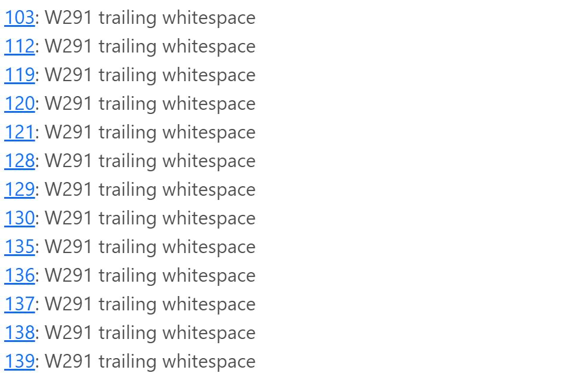

# Hangman 
Welcome to my interactive Hangman game built using python. 

# Table of Contents

# Project Overview
This project is based on the game Hangman. Playing this game, the user must guess the full word before the hangman is hung (drawn). This is done by guessing each letter in the word. 

If the guess is right, it is placed in the blank spaces that make up the word. If it is not, it is placed in the incorrect guesses section and the user loses a life, the construction of the hanging man starts. The word must be guessed before the user runs out of lives.

The user can play the game at three different levels of difficulty, based on the number of lives. 8 lives for Easy, 6 lives for Medium and 4 lives for Hard.

At the beginning of the game, the player is asked to give their name, which is then held and used to wish them goodluck, and at the end of the game to congratulate them or tell them they've lost. 

Once the game is finished, the player is asked if they'd like to play again. Entering yes will restart the game with a new word and they can choose the difficulty again too. Entering no, will conclude the game. 

# Game Flowchart
When planning the game, it was important to build a full game flow so that I could think about the functions, what commands and what user inputs would be needed for everything to work. To build this, I created a flowchart using Lucid.

# How to Play
The player chooses the difficulty level and a random word will be showing use (_) in place of the letters. The player starts to guess letters one at a time (if the player does not enter a valid letter or one at a time there will be a error). If the letter is in the word it will fill the location of the _ blank. If the letter is not in the word, the user loses a life, it will say how many lives remain, and the letter will be added to the incorrect guesses section. The hangman will also start to build.

The player keeps guessing until completing the word. For winning the game, the user will be congratulated. For losing the game, the user will be told and it will tell them what the word was so they know. 

The user can choose to play again or exit.

# Features

# Testing
* Tested for various bugs and functionality but inputting incorrect data, etc.
* Tested for scenarios with successful guesses (valid letters only)
* This game was tested using Firefox, Google Chrome and Internet Explorer.

# PEP8 Validator [Code Institute](https://pep8ci.herokuapp.com/#)
* I used Code Institutes Python Linter. Which can be found [here](https://pep8ci.herokuapp.com/#) to validate my python code.
* All errors and warnings were fixed, bar the warrings for my Hangman logo and the hangman drawing itself (clearing whitespace). This would of affected the look and functionality of the game so I chose to ignore these errors. 

* Other errors such as not leaving to blank lines between the comment and the function, or indentations, or some issues with lines over 79 characters long were fixed.

# Bugs
1. The first bug was when the hangman game would not display the word in my choose_word function. However, it was down to my misspelling of skip and in the while loop.
2. When entering yes to play again, it wasn't letting me. I fixed this by adding a .lower() method instead of .upper() and it seemed to work correctly after that.
3. If the user guessed a letter, that was correct it was not adding it to the blank spaces provided. With the help of [Kite](https://www.youtube.com/watch?v=m4nEnsavl6w) and [Kylie Ying](https://www.youtube.com/watch?v=cJJTnI22IF8) I was able to fix this issue!
4. Another problem I found, when I wanted to add some color to my program to make it look better, I really struggled. If I added a color to the user name, it would color everything after that, etc! But the code on [GeeksForGeeks](https://www.geeksforgeeks.org/print-colors-python-terminal/) helped me solve this issue. 
5. Finally, when using the CI python linter to validate my code, I may have copied in my hangman function incorrectly and it threw my while loop indentation out of whack. This threw me a lot as the game would suddenly end after 1, or 2 or 3 guesses if I still had lives left. But thankfully I could see the indentation problem after some help from a friend. 

